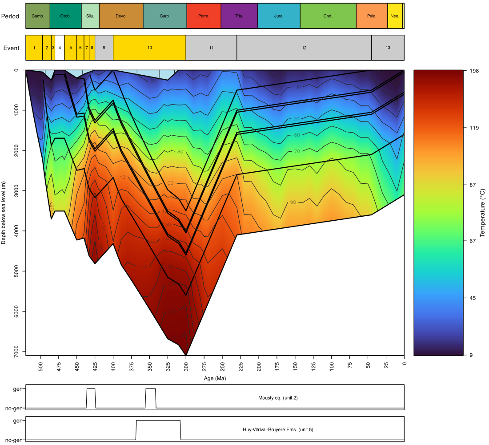
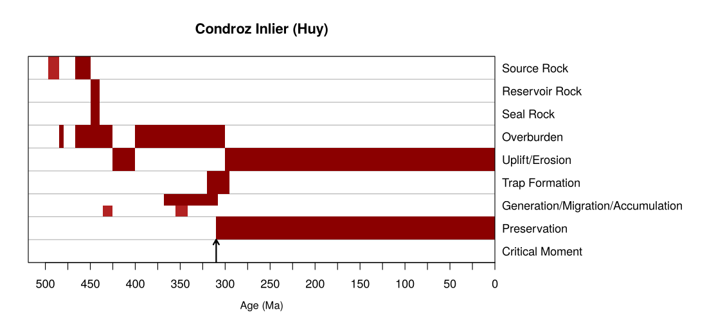

# BasinmodlR

BasinmodlR is an R package for one-dimensional (1D) burial, compaction and
thermal history modelling of sedimentary basins. It is aimed at geologists and
stratigraphers who want to reconstruct how deep a stratigraphic unit was buried,
how much it was compacted and how hot it became through geological time,
starting from a stratigraphic column. A basin is described by two small tables,
one row per stratigraphic unit and one row per erosion event. From these tables
the package derives deposition phases, hiatuses, layer stacks, maximum-burial
windows and grain (solid) thicknesses. Compaction follows an exponential
porosity-depth law and is irreversible, so that uplifted layers keep the
porosity they acquired at their deepest burial. Temperatures are the
steady-state conductive geotherm of the layered column including radiogenic
heat production. The methods follow Allen and Allen (2013). The package
includes functions to draw a composite figure of the burial path, temperature
and hydrocarbon generation windows, and a petroleum system event chart.

## Installation

You can install the development version of BasinmodlR from
[GitHub](https://github.com/stratigraphy/basinmodlR) with:

``` r
# install.packages("devtools")
devtools::install_github("stratigraphy/basinmodlR")
```

## Example

``` r
library(BasinmodlR)

# Burial and thermal history of the Huy section (Condroz inlier, Belgium)
res <- run_basin_model(condroz)
res

# Burial path, temperature and hydrocarbon generation windows
plot_basin_model(res)

# Petroleum system event chart
plot_event_chart(res,
                 source_units = c(2, 4),
                 reservoir_units = 5,
                 seal_units = 5,
                 trap_formation = data.frame(start = 320, end = 295),
                 critical_moment = 310)
```





## Reference

Allen, P.A. and Allen, J.R. (2013). Basin Analysis: Principles and
Applications, 3rd ed. Blackwell Publishing, Oxford, 619 p.
